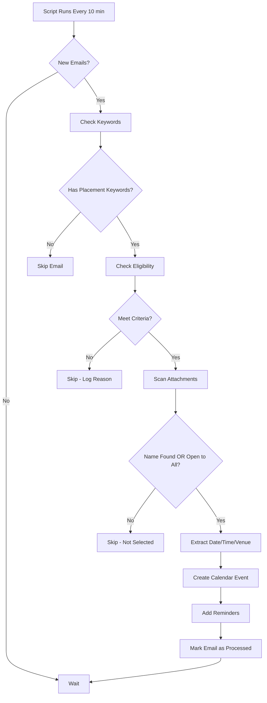

<div align="center">

# 📅 PlacetTrac - Smart Placement Calendar Automation


**Never miss a placement opportunity again!** 🎯

*Automatically scans your placement emails, extracts event details, checks eligibility, and creates Google Calendar events - all while you sleep.*

[Features](#-features) • [Quick Start](#-quick-start) • [Configuration](#-configuration-guide) • [How It Works](#-how-it-works) • [FAQ](#-faq)

---

### 🌟 Created by [@asif-mp3](https://github.com/asif-mp3)

*Building automation tools for students | Open source enthusiast | Making campus life easier*

[](https://github.com/asif-mp3)
[](https://github.com/asif-mp3)

</div>

---

## 🎯 Why PlacetTrac?

Tired of manually checking placement emails? Missing deadlines? Confused about eligibility? **PlacetTrac** is your AI-powered placement assistant that:

- 🔍 **Scans** your inbox for placement opportunities
- 🧠 **Understands** eligibility criteria (CGPA, branch, backlogs)
- ✅ **Verifies** if you're shortlisted by checking attachments
- 📅 **Creates** calendar events automatically
- ⏰ **Reminds** you before deadlines
- 🎓 **Filters** irrelevant opportunities

## ✨ Features

<table>
<tr>
<td width="50%">

### 🤖 Smart Detection
- Automatically identifies placement emails
- Extracts dates, times, and venues
- Finds registration links
- Detects event type (interview, test, PPT)

</td>
<td width="50%">

### 🎯 Eligibility Checking
- Validates CGPA requirements
- Checks branch eligibility
- Verifies 10th/12th percentages
- Detects backlog restrictions

</td>
</tr>
<tr>
<td width="50%">

### 📋 Candidate Verification
- Scans Excel/CSV attachments for your name
- Reads PDF shortlists
- Checks email body for mentions
- Only creates events if you're selected

</td>
<td width="50%">

### 📅 Calendar Integration
- Creates detailed calendar events
- Adds venue and duration info
- Sets smart reminders
- Links back to original email

</td>
</tr>
</table>

## 🚀 Quick Start

### Prerequisites

- Google Account (Gmail + Calendar)
- 10 minutes of setup time
- Basic understanding of copy-paste 😉

### Installation Steps

#### Step 1: Create a New Google Apps Script Project

1. Go to [Google Apps Script](https://script.google.com/)
2. Click **"New Project"**
3. Name it **"PlacetTrac Automation"**

#### Step 2: Enable Required APIs

1. In your Apps Script project, click on **"Services"** (+ icon on left sidebar)
2. Add these services:
   - ✅ **Gmail API** (v1)
   - ✅ **Google Calendar API** (v3)
   - ✅ **Drive API** (v3)

#### Step 3: Copy the Code

1. Delete any existing code in `Code.gs`
2. Copy the entire script from [`PlacetTrac.gs`](./PlacetTrac.gs)
3. Paste it into your Apps Script editor

#### Step 4: Configure Your Details

**🔴 CRITICAL: You must replace these values in the `CONFIG` object:**

```javascript
// Line 20-40 in the script - REPLACE THESE:

MY_NAME: "Your Full Name",              // ⚠️ Replace with: Brynn Huang
MY_REG: "YOUR_REG_NUMBER",              // ⚠️ Replace with: 22BCE1634
MY_BRANCH: "Your Branch Name",          // ⚠️ Replace with: Computer Science Engineering
MY_CGPA: 0.0,                           // ⚠️ Replace with: 8.75
MY_PERCENTAGE: 0.0,                     // ⚠️ Replace with: 95.5
MY_10TH: 0,                             // ⚠️ Replace with: 94
MY_12TH: 0,                             // ⚠️ Replace with: 95
MY_BACKLOGS: 0,                         // ⚠️ Replace with: 0 (or your backlog count)
MY_EMAIL: "your.email@college.edu",     // ⚠️ Replace with: your.email@vitstudent.ac.in
```

**📧 Update Email Senders (Line 77-85):**

```javascript
ALLOWED_SENDERS: [
  "placement@college.edu",     // ⚠️ Replace with your college CDC email
  "cdc@college.edu",           // ⚠️ Add more sender emails
  "careers@college.edu",       // ⚠️ Example: vitianscdc2026@vitstudent.ac.in
  "placement",                 // Keep these generic keywords
  "cdc",
  "career",
  "recruitment",
  "hr"
],
```

**🗓️ Optional: Use a Dedicated Calendar (Line 128):**

```javascript
CALENDAR_ID: "",  // Leave empty for default calendar
                  // OR paste your calendar ID from Calendar Settings > Integrate calendar
```

#### Step 5: Authorize the Script

1. Click **"Run"** button (▶️) at the top
2. Select function: **`myFunction`**
3. Click **"Review Permissions"**
4. Choose your Google account
5. Click **"Advanced"** → **"Go to PlacetTrac (unsafe)"**
6. Click **"Allow"**

> ⚠️ Google shows this warning because it's a custom script. It's safe - you wrote it!

#### Step 6: Set Up Automatic Trigger

1. Click **"Triggers"** (⏰ icon on left sidebar)
2. Click **"+ Add Trigger"**
3. Configure:
   - Function: **`myFunction`**
   - Deployment: **Head**
   - Event source: **Time-driven**
   - Type: **Minutes timer**
   - Interval: **Every 10 minutes** (or 15/30 as preferred)
4. Click **"Save"**

#### Step 7: Test It!

1. Send yourself a test email with placement keywords
2. Wait for the trigger to run (or run manually)
3. Check your Google Calendar
4. Check **Apps Script Logs** (Executions tab) for debugging

---

## 📝 Configuration Guide

### Understanding the CONFIG Object

| Parameter | What It Does | Example Value |
|-----------|-------------|---------------|
| `MY_NAME` | Your full name (case-insensitive) | `"Brynn Huang"` |
| `MY_REG` | Registration/roll number | `"22BCE1634"` |
| `MY_BRANCH` | Your academic branch | `"Computer Science Engineering"` |
| `MY_CGPA` | Current CGPA | `8.75` |
| `MY_PERCENTAGE` | Current overall percentage | `95.5` |
| `MY_10TH` | 10th grade percentage | `94` |
| `MY_12TH` | 12th grade percentage | `95` |
| `MY_BACKLOGS` | Number of active backlogs | `0` |
| `MY_EMAIL` | Your primary email | `"student@college.edu"` |
| `ALLOWED_SENDERS` | Email addresses to monitor | Array of strings |
| `CALENDAR_ID` | Target calendar ID (optional) | `"abc123@group.calendar.google.com"` |
| `ELIGIBILITY_TOLERANCE` | CGPA flexibility | `0.3` (7.5 req → 7.2 accepted) |
| `SEND_SUMMARY_EMAIL` | Get email summaries | `true` / `false` |

### Branch Name Aliases

The script understands common abbreviations. If your branch isn't listed, add it to `ALLOWED_BRANCH_ALIASES`:

```javascript
"ds": "Data Science",
"cyber": "Cyber Security",
"iot": "Internet of Things",
```

### Advanced Settings

```javascript
DEFAULT_EVENT_DURATION_MINUTES: 60,  // Default event length
RETENTION_DAYS: 60,                   // How long to remember processed emails
SEARCH_WINDOW_MINUTES: 30,            // How recent emails to check
LABEL_NAME: "AutoCalendarProcessed",  // Gmail label for processed emails
```

---

## 🔍 How It Works



### Event Creation Logic

PlacetTrac creates calendar events **ONLY IF**:

1. ✅ Your name/reg number appears in:
   - Email body
   - PDF attachments
   - Excel/CSV files
   
   **OR**

2. ✅ Event is explicitly "open to all" (detected by phrases like "all students who applied", "everyone is invited", etc.)

This prevents cluttering your calendar with opportunities you're not selected for!

---

## 📧 Email Patterns Recognized

### Dates & Times

```
✅ "Interview on 1-10-2025 at 3:00 PM"
✅ "Deadline: 30/09/2025 by 5:00 pm"
✅ "Scheduled for 15th October 2025"
✅ "Last date: Oct 20, 2025"
✅ "Assessment: 1st Nov 2025, 2:30 PM"
```

### Venues

```
✅ "Venue: SJT Block, Room 301"
✅ "Location: Computer Lab 1"
✅ "Online Assessment" → Tagged as "Online"
```

### Registration Links

```
✅ Detects URLs with: register, registration, apply, form, neopat
✅ Special handling for NEOPAT portal
```

### Eligibility Criteria

```
✅ "Minimum CGPA: 7.5"
✅ "Eligible branches: CSE, IT, ECE"
✅ "10th: 80%, 12th: 85%"
✅ "No active backlogs"
```

---

## 🎨 Calendar Event Format

Each created event includes:

```
📍 Venue: SJT Block, Room 301
⏱️ Duration: 60 minutes

✅ YOU ARE SELECTED/SHORTLISTED
   Your name/reg number found in candidate list

📋 Eligibility:
   • CGPA: 7.5+
   • Branch: Computer Science Engineering
   • No backlogs

📝 Register here: https://registration-link.com

📧 Original Email: [Link to Gmail thread]

💡 Checklist:
   ✓ Bring ID card
   ✓ Arrive 15-20 mins early
   ✓ Carry resume copies
   ✓ Check dress code if mentioned
```

---

## 🛠️ Troubleshooting

### Script Not Running?

<details>
<summary><b>Check Trigger Status</b></summary>

1. Go to **Triggers** (⏰ icon)
2. Verify trigger is **enabled**
3. Check **Executions** tab for errors
4. Look for red ❌ marks indicating failures

</details>

<details>
<summary><b>Authorization Issues</b></summary>

1. Delete existing trigger
2. Go to **Executions** → Clear all
3. Run `myFunction` manually
4. Re-authorize when prompted
5. Create new trigger

</details>

<details>
<summary><b>No Events Being Created</b></summary>

**Possible Reasons:**
- Your name/reg not in email or attachments
- Event not "open to all"
- Wrong sender email (not in `ALLOWED_SENDERS`)
- No placement keywords detected
- Eligibility criteria not met

**Debug:**
1. Run script manually
2. Check **Logs** (View → Logs or Ctrl+Enter)
3. Look for skip reasons
4. Verify your `CONFIG` values are correct

</details>

<details>
<summary><b>Events Created for Wrong Person</b></summary>

- Double-check `MY_NAME` and `MY_REG` in CONFIG
- Ensure exact spelling/format as in emails
- Names are case-insensitive but must match

</details>

<details>
<summary><b>Missing Attachments Scanning</b></summary>

- Ensure **Drive API** is enabled
- Check quota limits (Execution tab)
- Large files may timeout - increase script timeout

</details>

### Common Error Messages

| Error | Solution |
|-------|----------|
| `Service invoked too many times` | Reduce trigger frequency or add delays |
| `Authorization required` | Re-authorize the script |
| `Calendar not found` | Check `CALENDAR_ID` or leave empty |
| `Cannot read property` | Verify all CONFIG fields are filled |

---

## 📊 Monitoring & Logs

### Enable Summary Emails (Optional)

In CONFIG, set:
```javascript
SEND_SUMMARY_EMAIL: true
```

You'll receive emails like:
```
📊 Statistics:
   • Emails Processed: 15
   • Events Created: 3
   • Opportunities Skipped: 8
   • Errors Encountered: 0

⏭️ Skipped Opportunities:
   1. Goldman Sachs - Software Engineer
      ❌ Branch restricted to: IT, CSE (you're in ECE)
   
   2. Amazon Assessment
      ❌ Your name not found in candidate list
```

### View Execution Logs

1. Apps Script Editor → Left sidebar
2. Click **"Executions"** (📊 icon)
3. See all script runs, durations, and errors
4. Click any execution → View logs

---

## 🔐 Privacy & Security

### What Data Does PlacetTrac Access?

- ✅ **Gmail**: Reads emails from specified senders
- ✅ **Calendar**: Creates/modifies events
- ✅ **Drive**: Temporarily converts attachments (auto-deleted)

### Data Storage

- ✅ All data stays in **your Google account**
- ✅ No external servers or databases
- ✅ Processed email IDs stored in Script Properties (for deduplication)

### Permissions Explained

| Permission | Why Needed |
|------------|------------|
| **View/manage Gmail** | Read placement emails and attachments |
| **View/manage Calendar** | Create calendar events |
| **View/manage Drive** | Convert Excel/PDF to readable format |
| **External requests** | None - script doesn't make external API calls |

---

## 🎓 For Different Colleges

### VIT Students
```javascript
ALLOWED_SENDERS: [
  "vitianscdc2026@vitstudent.ac.in",
  "ccbce22@vitstudent.ac.in",
  "placement"
]
```

### BITS Students
```javascript
ALLOWED_SENDERS: [
  "placement@pilani.bits-pilani.ac.in",
  "cdc"
]
```

### NIT Students
```javascript
ALLOWED_SENDERS: [
  "placements@nitrkl.ac.in",
  "tpo@nitrourkela.ac.in"
]
```

### General Template
```javascript
ALLOWED_SENDERS: [
  "placement@yourcollege.edu",
  "cdc@yourcollege.edu",
  "career@yourcollege.edu",
  "tpo@yourcollege.edu",
  "placement", "cdc", "career", "recruitment", "hr"
]
```

---

## 🤝 Contributing

Found a bug? Have a feature idea? Contributions are welcome!

1. Fork the repository
2. Create your feature branch (`git checkout -b feature/AmazingFeature`)
3. Commit your changes (`git commit -m 'Add some AmazingFeature'`)
4. Push to the branch (`git push origin feature/AmazingFeature`)
5. Open a Pull Request

### Areas for Improvement

- 🌐 Multi-language support
- 📱 Mobile app companion
- 🎨 Calendar color coding by company/type
- 📈 Analytics dashboard
- 🔔 Telegram/Discord notifications
- 🧪 ML-based eligibility prediction

---

## ❓ FAQ

<details>
<summary><b>Does this work for internships too?</b></summary>

Yes! Add keywords like "internship", "intern", "summer training" to the `KEYWORDS` array.

</details>

<details>
<summary><b>Can I use multiple calendars?</b></summary>

Yes! Create separate calendar IDs for different companies or event types. You'd need to modify the script to route events accordingly.

</details>

<details>
<summary><b>What if I have multiple email addresses?</b></summary>

Add all your emails to `ALLOWED_SENDERS` or forward placement emails to one account.

</details>

<details>
<summary><b>Does it delete duplicate events?</b></summary>

Yes! PlacetTrac checks if an event already exists before creating a new one (within a 10-minute window).

</details>

<details>
<summary><b>How do I stop the automation?</b></summary>

Go to **Triggers** → Click trash icon (🗑️) next to the trigger → Confirm deletion.

</details>

<details>
<summary><b>Can I customize reminder timings?</b></summary>

Yes! In the script, find `createCalendarEvent` function and modify the reminder arrays:
```javascript
[1440, 120]  // 1 day before, 2 hours before
[60, 15]     // 1 hour before, 15 mins before
```

</details>

<details>
<summary><b>What about offline events on campus?</b></summary>

PlacetTrac extracts venue information and marks events as "Online" only if explicitly mentioned. Campus events work perfectly!

</details>

---

## 📜 License

This project is licensed under the **MIT License** - see the [LICENSE](LICENSE) file for details.

Free to use, modify, and distribute. Attribution appreciated! 🙏

---

## 💖 Support the Project

If PlacetTrac helped you land that dream placement, consider:

- ⭐ **Star this repository**
- 🐦 **Share on social media**
- 🍕 **Buy me a coffee** (if you're feeling generous!)
- 📝 **Write a review/testimonial**
- 🐛 **Report bugs or suggest features**
- 
---

<div align="center">

## 🚀 Ready to Automate Your Placement Journey?

**[⬆️ Back to Top](#-PlacetTrac---smart-placement-calendar-automation) | [🐛 Report Bug](https://github.com/asif-mp3/PlacetTrac/issues) | [💡 Request Feature](https://github.com/asif-mp3/PlacetTrac/issues)**

---

### Made with ❤️ by [@asif-mp3](https://github.com/asif-mp3)

*Empowering students through automation*

[](https://github.com/asif-mp3)
[](mailto:asifoned@gmail.com)

**⚡ Star this repo if you found it helpful!**

</div>
